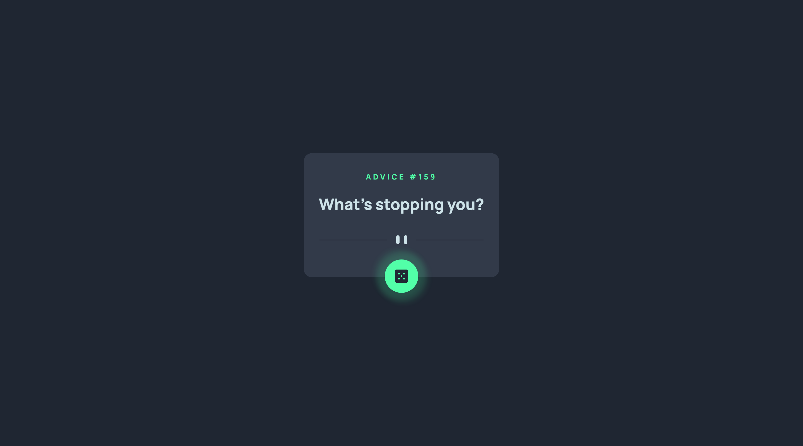

# Advice generator app

## Overview

Users should be able to:

- View the optimal layout for the app depending on their device's screen size
- See hover states for all interactive elements on the page
- Generate a new piece of advice by clicking the dice icon

### Screenshot

**Snapshot at desktop width 1440px > with Hover activate**

### Built with

- JavaScript
- Semantic HTML5 markup
- CSS custom properties
- Flexbox
- Mobile-first workflow

### Concepts used

As this is API based project, I used _async, await and fetch_.

### Continued development

We can use different APIs and dark-light theme change.

### Useful resources

- API from [Advice API](https://api.adviceslip.com/advice)

- Font from [Google Fonts](https://fonts.googleapis.com/css2?family=Manrope:wght@800&display=swap)

## Author

Meenu Soni 👨‍💻

